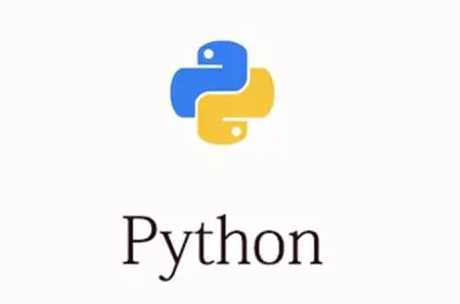
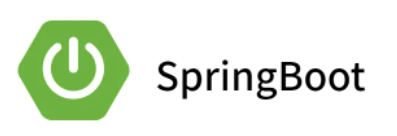

- 👋 Hi, I’m @Tajigaqzh. I’m interested in Java, javascript, typescript, Python. I’m currently learning react.

# 💡skills

### 前端

    
    
    
    
    
    
    
    
    
    
    
    
    
    
    
    

### 后端

    
    
    
    
    

### Java 技术栈

    
    
    
    
    
    
    
    
    
    

### 数据库

    
    
    
    
    

### 运维

    
    
    
    

